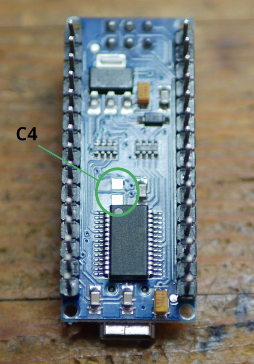
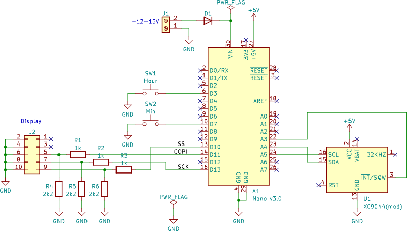
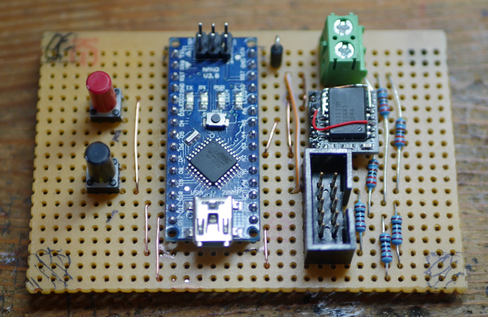

# avr-flipdrv
AVR m328p (Nano) Serial Flipdot Display and Clock

Drive a row of [4x5 flippnlr panels](https://github.com/ndf-zz/flipdot)
from USB serial, using an Arduino Nano and a DS3231 RTC module.

Time of day is updated to the display once per minute. Updates
are paused for a minute whenever serial data is received.

## Serial Interface

   - USB Serial: 9600 baud, 8n1 (ftdi)
   - ASCII text (0x21-0x7f): Place character and move forward 4 columns
   - 0x80 - 0x9f: Place lower 5 bits in current column and move to next column
   - 0xc0 - 0xdf: Move to column offset specified by lower 5 bits
   - End of Transmission (0x04): Display current line
   - Bell (0x07): Flip all pixels on and Return
   - Backspace (0x08): Move back one column
   - Tab (0x09): Move forward 4 columns
   - Line Feed (0x0a): Display current line and Return
   - Form Feed (0x0c): Clear display and Return
   - Carriage Return (0x0d): Return
   - Data Link Escape (0x10): Flag update of all display pixels
   - DC1 (0x11): Enable display of internal clock
   - DC2 (0x12): Zero RTC seconds
   - DC3 (0x13): Disable display of internal clock and clear display
   - Space (0x20): Move forward 1 column

Note: On the Arduino Nano, DTR is wired to MCU reset. To avoid
inadvertently resetting the MCU when opening a serial port,
use stty to disable sending hangup signal eg:

	$ stty -hup </dev/ttyUSB0

Alternatively, de-solder 100nF capacitor C4 between 'RESET'
and 'DTR#' on the underside of the PCB to permanently
disconnect DTR:

## Example

Flash display, show "Hi!", then clear display:

	$ echo -en '\x07   Hi!\n\x0c' > /dev/ttyUSB0

https://github.com/ndf-zz/avr-flipdrv/raw/main/example.mp4

## Requirements

   - make
   - [avr-libc](https://www.nongnu.org/avr-libc/user-manual/index.html)
     Standard C library for Atmel AVR development
   - gcc-avr GNU C compiler (cross compiler for avr)
   - binutils-avr Binary utilities supporting Atmel's AVR targets
   - avrdude for programming Atmel AVR microcontrollers
   - python3-serial (optional)

Install requirements with apt:

	$ make requires

## Hardware

Connect display control lines to the Nano through
a voltage divider as per the schematic:

If using "RTC Clock Module for Raspberry Pi" (Jaycar cat XC9044),
add a wire short from pin 3 on the DS3231 (/INT) to the non-connected
header pin and short pins 5-12 on the RTC to ground. Note that the
XC9044 module has pull-ups in place for the SDA and SCL lines, but not
for the /INT signal.

## Install

Connect AVR ISP to programming header, program fuses,
upload firmware to MCU:

	$ make fuse
	$ make upload
